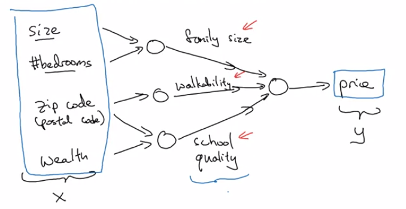

# Introduction to Deep Learning
  - Deep Learning은 헬스 케어, 개인화된 교육, x레이 사진 분류, 농업, 자율 주행과 같은 다양한 분야에서 더 나은 결과를 만드는 것을 돕는 다양한 방법을 실현해주고 있다.
  - AI는 새로운 전기이다. 전기가 생겨나 우리의 생활에 큰 변화를 가져온 것 처럼 AI 또한 그럴 것이다.

## Courses in this sequence (Specialization)
  1. Neural Networks and Deep Learning
  2. Improving Deep Neural Networks: Hyperparameter tuning, Regulariztion and Optimization
  3. Structuring your Machine Learning project
  4. Convolutional Neural Networks (CNN)
  5. Natural Language Processing: Building sequence models (RNN, LSTM)
  
# What is a Neural Network?
  - size (x) -> neuron -> price (y) : single neuron
  - Neural Network는 입력 값들의 특징들을 자유롭게 반영한 각각의 unit을 예측하고 또 새로운 층의 unit들을 예측하는 것을 반복적으로 수행한 후 결과를 예측하는 것
    
  - Neural Network에서는 입력층input layer의 모든 특징들과 숨겨진 층hidden layer의 모든 유닛들이 연결되어있다.
  
# Supervised Learning with Neural Networks
